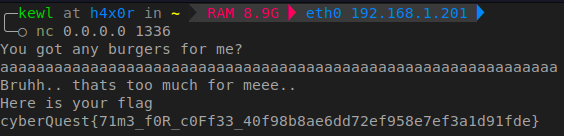

## Solution

We are provided with both the source code and the compiled binary. Let's analyse the source code first:

```c
#include <stdio.h>
#include <stdlib.h>
#include <string.h>

void win() {
    FILE *fp = fopen("flag.txt", "r");
    if (fp == NULL) {
        perror("Error opening flag.txt");
        exit(1);
    }

    char flag[100];
    fgets(flag, sizeof(flag), fp);
    printf("%s\n", flag);
    fclose(fp);
}

int main() {
    setbuf(stdout, NULL);
    int whatIWant = 0xBAADF00D;
    char whatYouGot[45];

    printf("You got any burgers for me?\n");
    gets(whatYouGot);
    if(whatIWant == 0xBAADF00D) {
        printf("HAHAHA... I can eat %zu burgers all day long\n", strlen(whatYouGot));        
    } else {
        printf("Bruhh.. that's too much for meee..\nHere is your flag\n");
        win();
    }
    return 0;
}
```

The key vulnerability here is the use of the unsafe gets() function, which does not check for buffer overflows.

During runtime, the program checks whether the value of `whatIWant` is `0xBAADF00D` or not. If yes, it displays a message, else `win()` function gets executed and we'll get the flag.

The buffer `whatYouGot` is only 45 bytes long, but since `gets()` doesn't limit the input length, we can overflow the buffer and modify the adjacent variable `whatIWant`.

To exploit the vulnerability, we simply need to provide input long enough to overflow the buffer and overwrite the whatIWant variable.

Exmaple input:
```
aaaaaaaaaaaaaaaaaaaaaaaaaaaaaaaaaaaaaaaaaaaaaaaaaaaaaaaaaaaaaa
```


