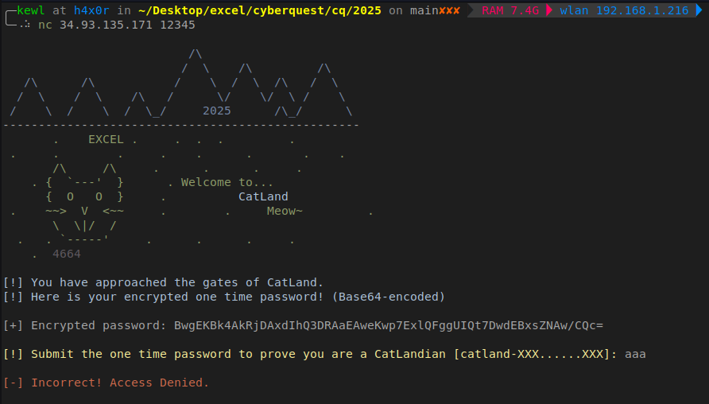

## CatLand Solution

```
nc 34.93.135.171 12345
```

Conneting to the ip & port using netcat gives us a auth portal that requires an OTP to proceed.



Decoding the enocded OTP gives random bytes. Here they have provided a hint

`[!] Submit the one time password to prove you are a CatLandian [catland-XXX......XXX]:`

Now we know the OTP starts with the text "catland-". So with this knowledge, we can try to get the key.

```ipython
In [1]: import base64

In [2]: base64.b64decode("BwgEKBk4AkRjDAxdIhQ3DRAaEAweKwp7ExlQFggUIQt7DwdEBxsZNAw/CQc=")
Out[2]: b'\x07\x08\x04(\x198\x02Dc\x0c\x0c]"\x147\r\x10\x1a\x10\x0c\x1e+\n{\x13\x19P\x16\x08\x14!\x0b{\x0f\x07D\x07\x1b\x194\x0c?\t\x07'
```

There is less chance the encrytion used could be caesar or vigenere. So the next best candidate is XOR.

Since we know the beginning of the OTP, we can recover some part of the key by XORing `catland-` and the decoded base64 bytes.

```ipython
In [3]: decoded=base64.b64decode("BwgEKBk4AkRjDAxdIhQ3DRAaEAweKwp7ExlQFggUIQt7DwdEBxsZNAw/CQc=")

In [4]: decoded[:9]
Out[4]: b'\x07\x08\x04(\x198\x02Dc'

In [5]: key=""

In [6]: ci="catland-"

In [10]: for i in range(len(ci)):
    ...:     key+=chr(ord(ci[i]) ^ decoded[i])
    ...: 

In [11]: key
Out[11]: 'dipDxVfi'
```

Now we have recoverd a part of the key. But we cannot use it to decode the whole OTP. we will have to find the length of the actual key. Then perform a brute force.

#### Finding the length of key

```ipython
In [12]: def decode(key,enc):
    ...:     d=""
    ...:     for i in range(len(enc)):
    ...:         d+=chr(ord(key[i%len(key)]) ^ enc[i])
    ...:     print(f"{key} : {d}")
    ...: 

In [13]: for i in range(3):
    ...:     decode(key+"a"*i, decoded)
    ...: 
dipDxVfi : catland-e|ZBQdts`Hf}lwp RpBGbfwM]hVyC
dipDxVfia : catland-he-flaky{tenor-up1rades-in%cription
dipDxVfiaa : catland-mh4RPO[vsqmzBz?kO6iuEb
                                           KarxUhVyC
```
We got a partially decrypted text with the key "dipDxVfia". Now we can conclude that the length of the key is 9

#### Bruteforcing

```ipython
In [15]: import string

In [18]: chars = string.ascii_letters + string.digits

In [24]: for i in chars:
    ...:     decode(key+i, decoded)

    ...: 
dipDxVfia : catland-he-flaky{tenor-up1rades-in%cription
dipDxVfib : catland-he-flakyxtenor-up2rades-in&cription
.
.
.
.
dipDxVfi4 : catland-Whe-flaky.tenor-updrades-inpcription
dipDxVfi5 : catland-Vhe-flaky/tenor-uperades-inqcription
dipDxVfi6 : catland-Uhe-flaky,tenor-upfrades-inrcription
dipDxVfi7 : catland-The-flaky-tenor-upgrades-inscription
dipDxVfi8 : catland-[he-flaky"tenor-uphrades-in|cription
dipDxVfi9 : catland-Zhe-flaky#tenor-upirades-in}cription
```

We got the decoded OTP after bruteforcing the 9th char of the key.

`dipDxVfi7 : catland-The-flaky-tenor-upgrades-inscription`

Submit the OTP and get the flag.