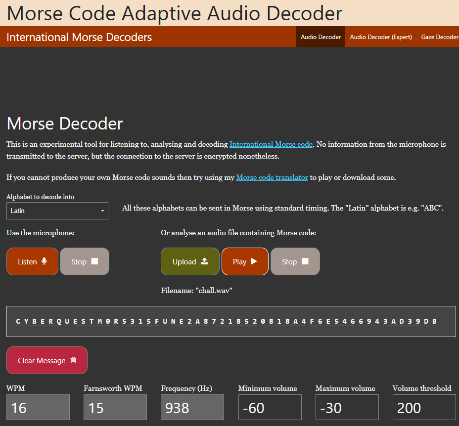

# Solution: Beep Bop

## Challenge Overview

You're given a mysterious audio file containing rhythmic beeps. These sounds are more than random noise — they're hiding a message.

---

##  Step 1: Listen to the Audio

Play the provided audio file. You'll notice a series of short and long beeps — a clear indicator of **Morse code**.

---

##  Step 2: Decode the Morse

Use any online Morse code decoder to translate the beeps. One such tool is:

👉 [Morse Audio Decoder](https://morsecode.world/international/decoder/audio-decoder-adaptive.html)

Once decoded, you’ll get a string resembling a flag.

---

##  Step 3: Format the Final Flag

Clean and format the decoded text to match the standard CyberQuest flag format.

✅ **Final Flag:**  
`cyberQuest{m0r53_15_fun_e2a87218520818a4f6e5466943ad39db}`
