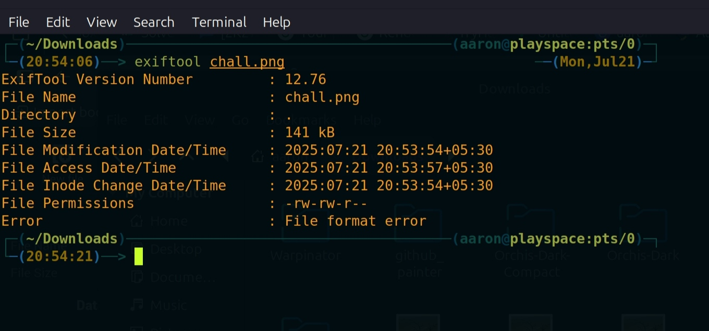
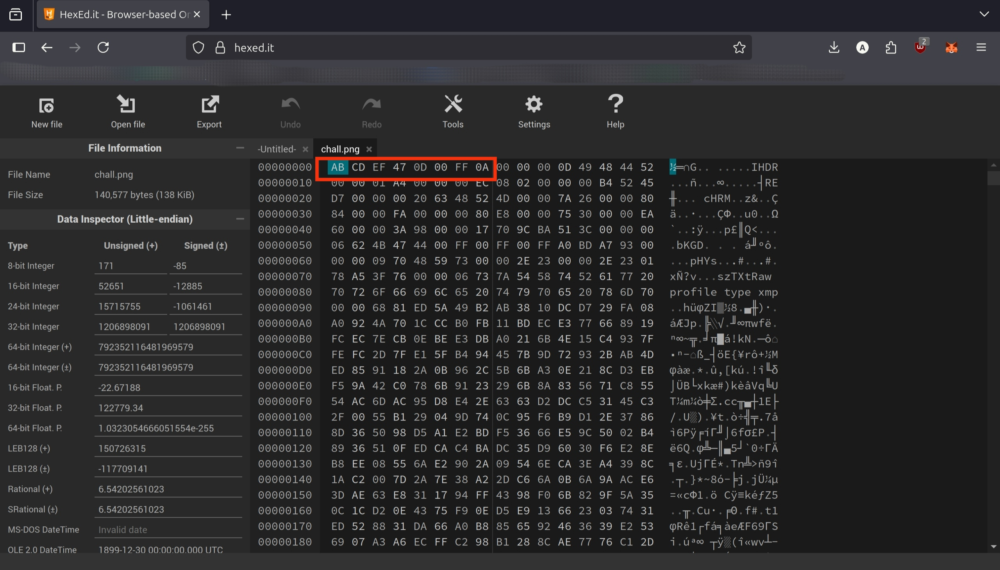
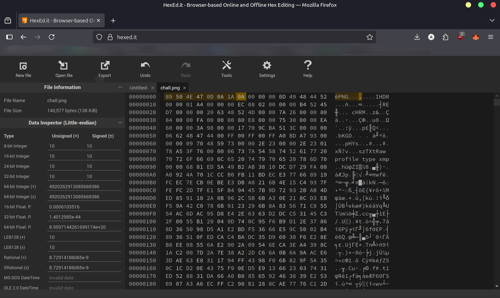
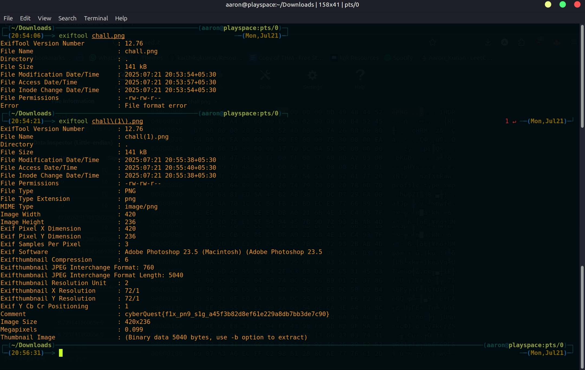

# Solution: PNGnosis

## Challenge Overview

This forensics challenge provides a corrupted PNG image that cannot be opened or analyzed with standard tools. The flag is hidden in the image's metadata, but the file structure is subtly broken.

---


## Step 1: Try to Analyze the Corrupted Image with exiftool 

Attempt to run exiftool on the provided `chall.png`:

```bash
exiftool chall.png
```

* The tool fails to recognize the file as a valid PNG and returns an error.



---

## Step 2: Inspect the PNG File in a Hex Editor 

Open `chall.png` in a hex editor (such as HxD, HexEd.it, or Bless).

* Notice that the file does not start with the standard PNG signature.
* Standard PNG files begin with the following 8-byte signature:
  ```
  89 50 4E 47 0D 0A 1A 0A
  ```
* The corrupted file has a different or missing signature, causing image viewers and tools to reject it.



---


## Step 3: Repair the PNG Header 

Overwrite the first 8 bytes of the file with the correct PNG signature. You can do this using a hex editor or with a Python one-liner:

```bash
python -c "with open('corrupted.png', 'r+b') as f: f.write(b'\x89\x50\x4E\x47\x0D\x0A\x1A\x0A')"
```

* Save the fixed file as `chall(1).png`.



---


## Step 4: Extract Metadata with exiftool

Run exiftool to inspect the metadata of the repaired image:

```bash
exiftool chall(1).png
```

* Look for a field such as `Comment`.
* The flag will be present in the metadata, e.g.:
  ```
  Comment                        : cyberQuest{.......}
  ```



---

## Step 4: Submit the Flag 

Copy the flag and submit it to complete the challenge!

---
