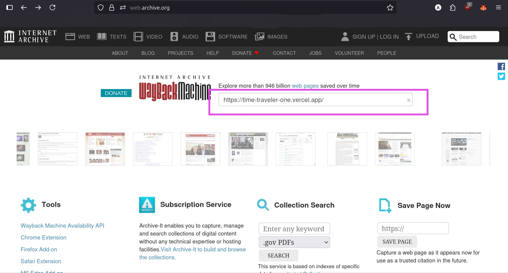
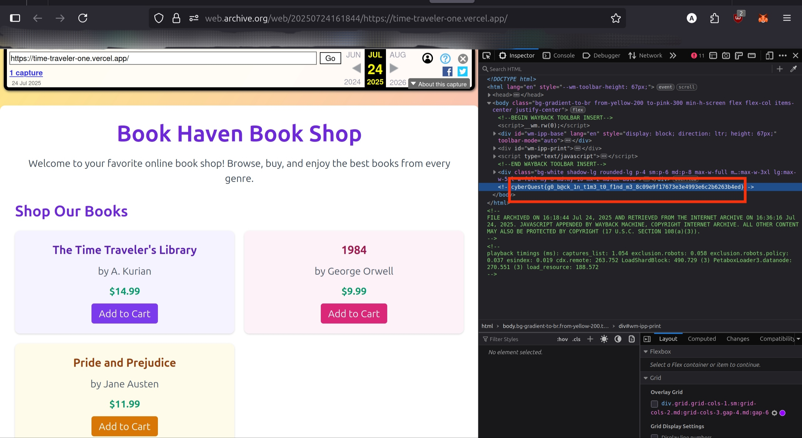

# Solution: Time Traveller

## Challenge Overview

This challenge is about using your OSINT and web investigation skills to recover a flag from the past. The answer is out there, you just need to know where (and when) to look!

---

### 1. Understand the Challenge

You are given a website URL, but visiting it doesn’t seem to reveal much. Maybe the answer isn’t in the present, but somewhere in the past…

---

### 2. Use the Wayback Machine

Go to the Wayback Machine at [web.archive.org](https://web.archive.org/).

Type or paste the website URL [time-traveler-one.vercel.app](https://time-traveler-one.vercel.app//) into the search bar and see if there are any archived snapshots.

---

### 3. Investigate the Archived Snapshot

If you find a snapshot, open it. Use your browser’s tools (like "View Page Source" or Inspect) to look for anything interesting or out of place in the page’s code or comments.

Sometimes, the past hides secrets in plain sight!

---

### 4. Submit the Flag

Copy the flag and submit it!

---

