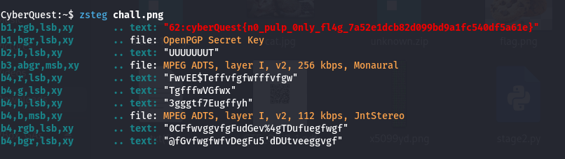

# Solution: JuicySecrets 🧃🔍

## Challenge Overview

You are presented with an innocent-looking image of a juice box. But something about it feels... suspiciously clean. The description hints:  
> "This juice box looks pure, but it’s not. Something's hiding inside, can you squeeze out the truth?"

Your mission: analyze the image and extract the hidden flag.

---

## Step 1: Inspect the File 🔎

Download the image and run basic file inspection tools to get a sense of whether anything is hidden.

📸 

---

## Step 2: Try Steganography 

Since nothing obvious came up, try tools that can reveal Least Significant Bit (LSB)-based steganography.

If using Kali Linux, try zsteg (for PNG):
📸 

---
## Step 3: Found the flag 🥳

The output from zsteg reveals a hidden ASCII string using the red channel’s least significant bit:
```bash
b1,r,lsb,xy: "cyberQuest{n0_pulp_0nly_fl4g_7a52e1dcb82d099bd9a1fc540df5a61e}"
```