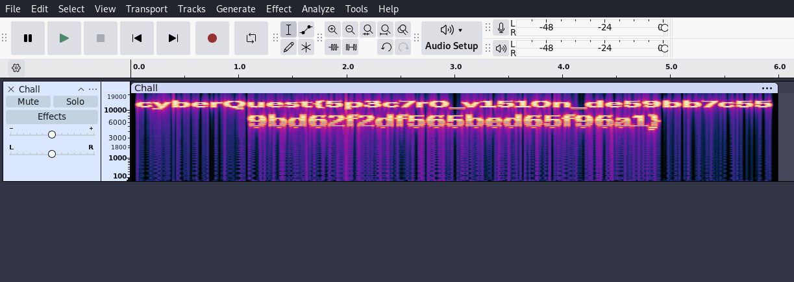

# Solution: Waveform Whispers

## Challenge Overview

You’ve received an odd audio file, filled with strange, pulsing sounds that don’t quite feel random.
Could it be hiding something? Let’s inspect it closely. There might be more than what meets the ear.
---

##  Step 1: Open the audio in a spectrogram viewer

Tools like Audacity/Sonic Visualiser allow you to view audio spectrograms:

In audacity: 
- File → Import → Audio
- At the track name, click the dropdown → Spectrogram View

---

##  Step 2: Observe the spectrogram

When zoomed and adjusted, a pattern of characters becomes visible in the spectrogram. This is not noise, it's a visual form of hidden data.

You’ll notice clear alphanumeric characters rendered across time and frequency. Read and transcribe them carefully.

---

##  Step 3: Retrieve the Flag

Once transcribed, format it properly into the required flag format.

✅ **Final Flag:**  
`cyberQuest{5p3c7r0_v1510n_de59bb7c559bd62f2df565bed65f96a1}`

